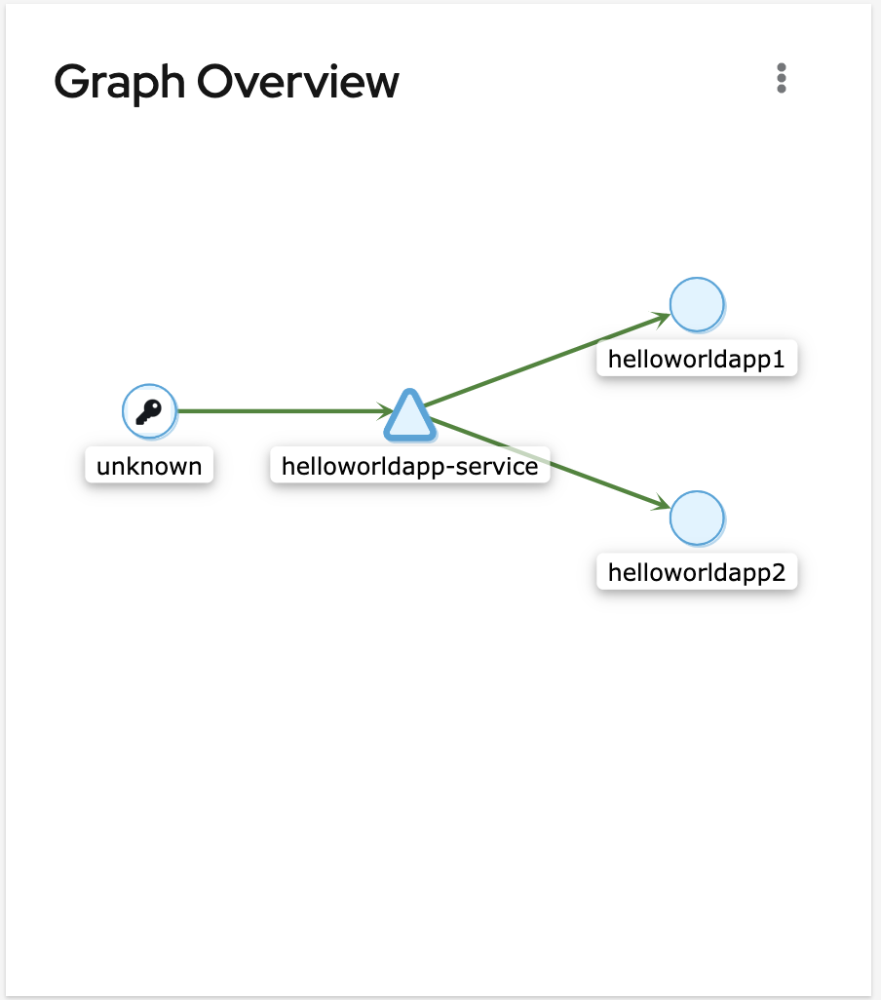
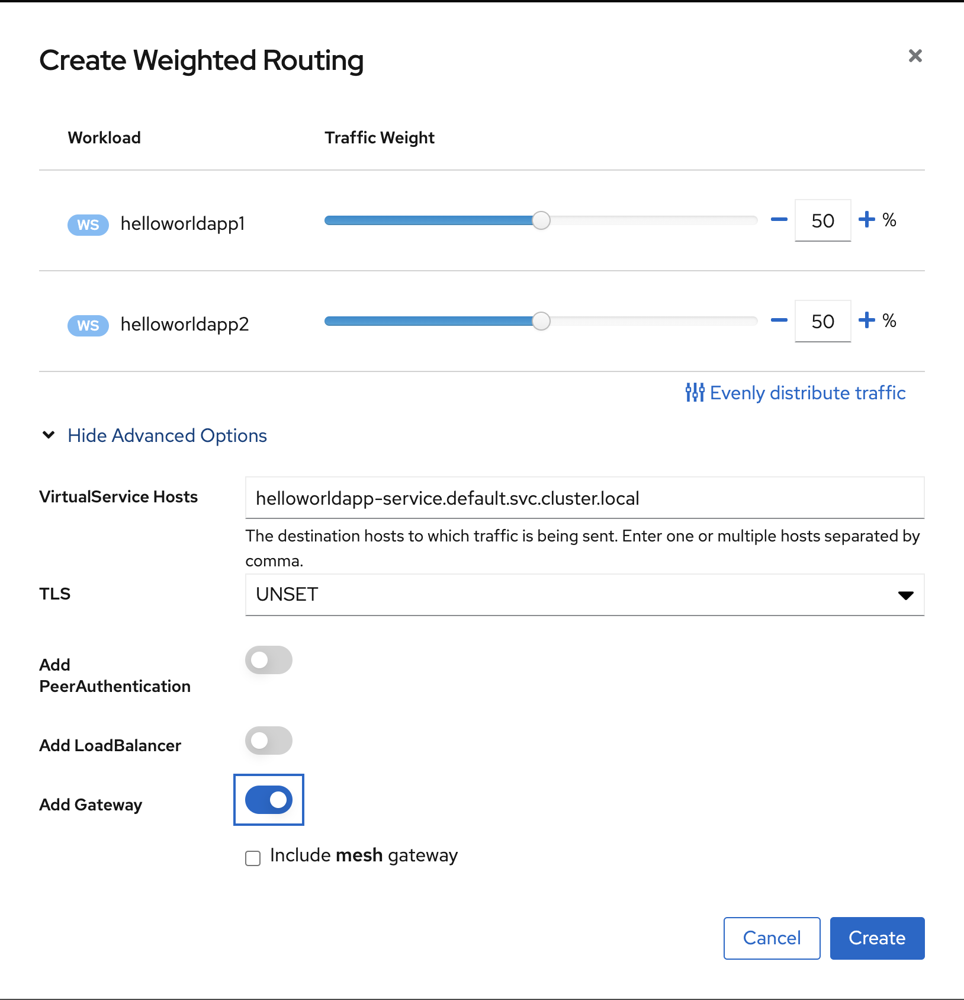
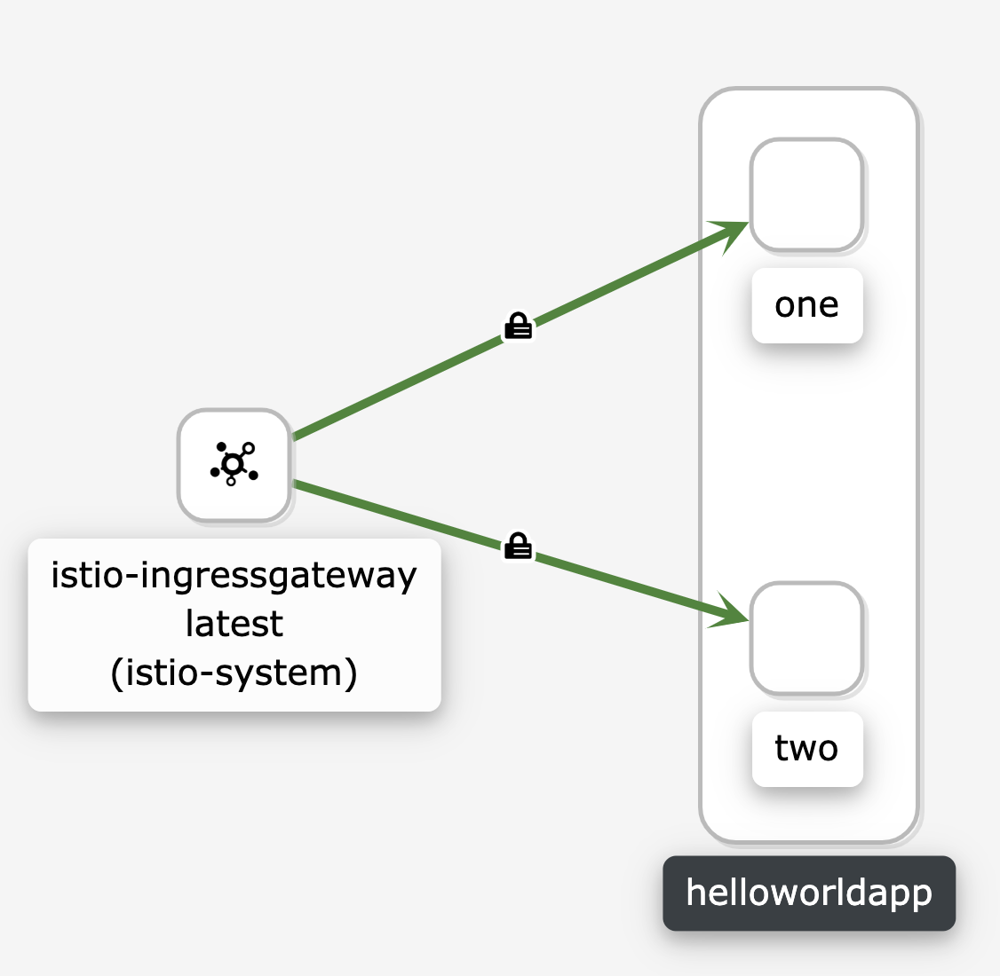
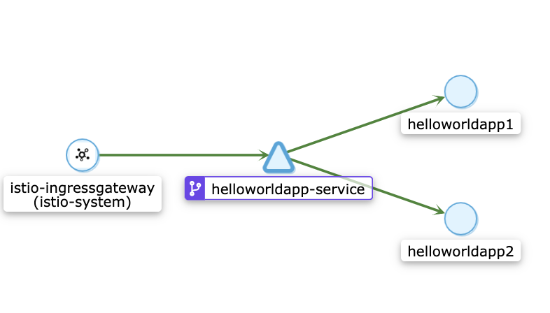

# 1.9 Service mesh на примере Istio

## Развернуть Minikube
Так как у меня Mac:
```
brew install minikube
minikube start -p otus
eval $(minikube -p otus docker-env)
brew install istioctl

```

## Развернуть Istio c Ingress gateway

### Ставим ISTIO
```
istioctl install --set profile=demo
```

- ✔ Istio core installed
- ✔ Istiod installed
- ✔ Egress gateways installed
- ✔ Ingress gateways installed
- ✔ Installation complete

### Ставим Kiali

Так как Kiali зависит от prometheus, то сначала ставим его. А для трассировки запросов ставим jaeger.

```
kubectl apply -f https://raw.githubusercontent.com/istio/istio/release-1.7/samples/addons/prometheus.yaml
kubectl apply -f https://raw.githubusercontent.com/istio/istio/release-1.7/samples/addons/kiali.yaml
kubectl apply -f https://raw.githubusercontent.com/istio/istio/release-1.7/samples/addons/jaeger.yaml
```

Проверяем, что Kiali  установилась:
```
wwtlf@MacBook-Pro-Boris-2 ~ % kubectl -n istio-system get svc kiali
NAME    TYPE        CLUSTER-IP      EXTERNAL-IP   PORT(S)              AGE
kiali   ClusterIP   10.100.125.15   <none>        20001/TCP,9090/TCP   4m8s
```
Смотрим ее dashboard:
```
istioctl dashboard kiali
```


## Развернуть две версии приложения с использованием Istio
Перед деплоем настраиваем автоматическую инжекцию sidecar'ов в default namespace:
```
kubectl label namespace default istio-injection=enabled
```

Тестовое приложение: https://github.com/WWTLF/otus-homework-istio/tree/master/HelloWorldApp

Разворачиваем два deployment с одним service на helloworldapp.
https://github.com/WWTLF/otus-homework-istio/blob/master/helloworld-deployment-service.yaml

```
apiVersion: apps/v1
kind: Deployment
metadata:
  name: helloworldapp1
  labels:
    app: helloworldapp 
spec:
  replicas: 1
  selector:
    matchLabels:
      app: helloworldapp
  template:
    metadata:
      labels:
        app: helloworldapp
        version: one
    spec:
      containers:
        - name: helloworldapp
          image: helloworldapp
          imagePullPolicy: Never
          ports:
            - containerPort: 8080
          env:
            - name: "MSG"
              value: "I am version 1"

---
apiVersion: apps/v1
kind: Deployment
metadata:
  name: helloworldapp2
  labels:
    app: helloworldapp    
spec:
  replicas: 1
  selector:
    matchLabels:
      app: helloworldapp
  template:
    metadata:
      labels:
        app: helloworldapp
        version: two
    spec:
      containers:
        - name: helloworldapp
          image: helloworldapp
          imagePullPolicy: Never
          ports:
            - containerPort: 8080
          env:
            - name: "MSG"
              value: "I am version 2"

---
apiVersion: v1
kind: Service
metadata:
  name: helloworldapp-service
  labels:
    app: helloworldapp
    service: helloworldapp-service
spec:
  type: NodePort
  ports:
  - port: 8080
    name: http
    nodePort: 30081
  selector:
    app: helloworldapp
```

У деплойментов разные env:
```
env:
  - name: "MSG"
    value: "I am version 2"
```
Приложение возвращает в GET запроса значение переменной среды MSG. 
До настройки ingress gateway и  virtual services:



```
wwtlf@MacBook-Pro-Boris-2 /etc % curl http://arch.homework:30081/ping
{"message":"I am version 1"}%                                                                                                                                    wwtlf@MacBook-Pro-Boris-2 /etc % curl http://arch.homework:30081/ping
{"message":"I am version 2"}%                                                                                                                                    wwtlf@MacBook-Pro-Boris-2 /etc % curl http://arch.homework:30081/ping
{"message":"I am version 2"}%                                                                                                                                    wwtlf@MacBook-Pro-Boris-2 /etc % curl http://arch.homework:30081/ping
{"message":"I am version 2"}%                                                                                                                                    wwtlf@MacBook-Pro-Boris-2 /etc % curl http://arch.homework:30081/ping
{"message":"I am version 1"}%                                                                                                                                    wwtlf@MacBook-Pro-Boris-2 /etc % curl http://arch.homework:30081/ping
{"message":"I am version 2"}%                                                                                                                                    wwtlf@MacBook-Pro-Boris-2 /etc % curl http://arch.homework:30081/ping
{"message":"I am version 2"}%                                                                                                                                    wwtlf@MacBook-Pro-Boris-2 /etc % curl http://arch.homework:30081/ping
{"message":"I am version 1"}%                                                                                                                                    wwtlf@MacBook-Pro-Boris-2 /etc % curl http://arch.homework:30081/ping
{"message":"I am version 2"}%                                                                                                                                    wwtlf@MacBook-Pro-Boris-2 /etc % curl http://arch.homework:30081/ping
{"message":"I am version 2"}%                                                                                                                                    wwtlf@MacBook-Pro-Boris-2 /etc % curl http://arch.homework:30081/ping
{"message":"I am version 1"}%                                                                                                                                    wwtlf@MacBook-Pro-Boris-2 /etc % curl http://arch.homework:30081/ping
{"message":"I am version 1"}%
```

## Настроить балансировку трафика между версиями приложения на уровне Gateway 50% на 50%

Настраиваем через kiali:



На выходе получаем следующий набор манифестов, которые можно было создать и руками:

### kind: VirtualService
```
kind: VirtualService
apiVersion: networking.istio.io/v1alpha3
metadata:
  name: helloworldapp-service
  namespace: default
  selfLink: >-
    /apis/networking.istio.io/v1alpha3/namespaces/default/virtualservices/helloworldapp-service
  uid: f0f2278f-85a0-4697-b956-6cb4b8dae372
  resourceVersion: '6459'
  generation: 1
  creationTimestamp: '2020-11-11T09:40:52Z'
  labels:
    kiali_wizard: weighted_routing
  managedFields:
    - manager: Go-http-client
      operation: Update
      apiVersion: networking.istio.io/v1alpha3
      time: '2020-11-11T09:40:52Z'
spec:
  hosts:
    - '*'
  gateways:
    - default/helloworldapp-service-gateway
  http:
    - route:
        - destination:
            host: helloworldapp-service.default.svc.cluster.local
            subset: one
          weight: 50
        - destination:
            host: helloworldapp-service.default.svc.cluster.local
            subset: two
          weight: 50

```
\*Только поле hosts надо поправить руками, в minikube  работате только '\*'

### kind: DestinationRule
```
kind: DestinationRule
apiVersion: networking.istio.io/v1alpha3
metadata:
  name: helloworldapp-service
  namespace: default
  selfLink: >-
    /apis/networking.istio.io/v1alpha3/namespaces/default/destinationrules/helloworldapp-service
  uid: 1b3e36a0-608f-4977-b330-be4f3410e53f
  resourceVersion: '6461'
  generation: 1
  creationTimestamp: '2020-11-11T09:40:52Z'
  labels:
    kiali_wizard: weighted_routing
  managedFields:
    - manager: Go-http-client
      operation: Update
      apiVersion: networking.istio.io/v1alpha3
      time: '2020-11-11T09:40:52Z'
spec:
  host: helloworldapp-service.default.svc.cluster.local
  subsets:
    - labels:
        version: one
      name: one
    - labels:
        version: two
      name: two

```

### kind: Gateway
```
kind: Gateway
apiVersion: networking.istio.io/v1alpha3
metadata:
  name: helloworldapp-service-gateway
  namespace: default
  selfLink: >-
    /apis/networking.istio.io/v1alpha3/namespaces/default/gateways/helloworldapp-service-gateway
  uid: 61460ba5-49c3-4d1e-9a02-157e219ccff7
  resourceVersion: '6460'
  generation: 1
  creationTimestamp: '2020-11-11T09:40:52Z'
  labels:
    kiali_wizard: weighted_routing
  managedFields:
    - manager: Go-http-client
      operation: Update
      apiVersion: networking.istio.io/v1alpha3
      time: '2020-11-11T09:40:52Z'
spec:
  servers:
    - hosts:
        - '*'
      port:
        name: http
        number: 80
        protocol: HTTP
  selector:
    istio: ingressgateway
```


## Сделать снимок экрана с картой запросов в Kiali с примеров вызова двух версии сервиса
Узнаем, на каком порту из миникуба выставился gateway:
```
kubectl -n istio-system get service istio-ingressgateway -o jsonpath='{.spec.ports[?(@.name=="http2")].nodePort}'
30858%
```
Проверяем через curl:
```
wwtlf@MacBook-Pro-Boris-2 /etc % curl http://arch.homework:30858/ping
{"message":"I am version 1"}%                                                                                                                                    wwtlf@MacBook-Pro-Boris-2 /etc % curl http://arch.homework:30858/ping
{"message":"I am version 2"}%                                                                                                                                    wwtlf@MacBook-Pro-Boris-2 /etc % curl http://arch.homework:30858/ping
{"message":"I am version 1"}%                                                                                                                                    wwtlf@MacBook-Pro-Boris-2 /etc % curl http://arch.homework:30858/ping
{"message":"I am version 1"}%                                                                                                                                    wwtlf@MacBook-Pro-Boris-2 /etc % curl http://arch.homework:30858/ping
{"message":"I am version 2"}%                                                                                                                                    wwtlf@MacBook-Pro-Boris-2 /etc % curl http://arch.homework:30858/ping
{"message":"I am version 1"}%                                                                                                                                    wwtlf@MacBook-Pro-Boris-2 /etc % curl http://arch.homework:30858/ping
{"message":"I am version 2"}%                                                                                                                                    wwtlf@MacBook-Pro-Boris-2 /etc % curl http://arch.homework:30858/ping
{"message":"I am version 1"}%                                                                                                                                    wwtlf@MacBook-Pro-Boris-2 /etc % curl http://arch.homework:30858/ping
{"message":"I am version 1"}%                                                                                                                                    wwtlf@MacBook-Pro-Boris-2 /etc % curl http://arch.homework:30858/ping
{"message":"I am version 1"}%
```



