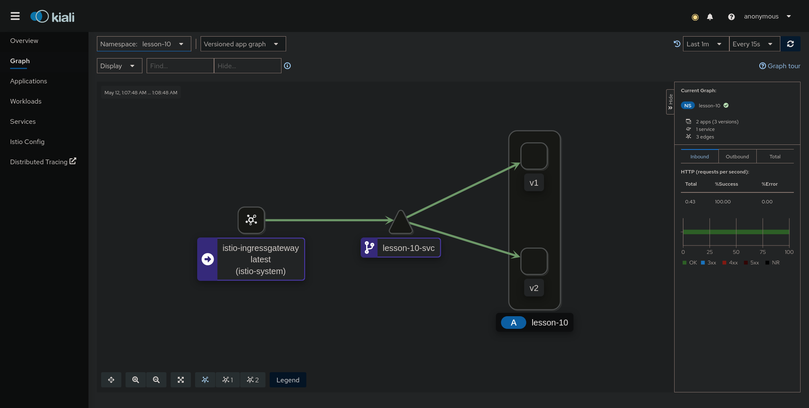

# Практика к занятию по теме "Service mesh на примере Istio"

## Зависимости

Для выполнения задания вам потребуется установить зависимости:

- [Minikube 1.13.1](https://github.com/kubernetes/minikube/releases/tag/v1.13.1)
- [Kubectl 0.19.2](https://github.com/kubernetes/kubectl/releases/tag/v0.19.2)
- [Istioctl 1.9.0](https://github.com/istio/istio/releases/tag/1.9.0)
- [Heml 3.3.4](https://github.com/helm/helm/releases/tag/v3.3.4)

После установки нужно запустить Kubernetes. При необходимости можно изменить используемый драйвер с помощью
флага `--driver`. 

```shell script
minikube start \
--cpus=4 --memory=8g \
--cni=flannel \
--kubernetes-version="v1.19.0" \
--extra-config=apiserver.enable-admission-plugins=NamespaceLifecycle,LimitRanger,ServiceAccount,DefaultStorageClass,\
DefaultTolerationSeconds,NodeRestriction,MutatingAdmissionWebhook,ValidatingAdmissionWebhook,ResourceQuota,PodPreset \
--extra-config=apiserver.authorization-mode=Node,RBAC
```

Операции будут совершаться с помощью утилиты `kubectl`

## Устройство Istio

Создать неймспейсы для операторов:

```shell script
kubectl apply -f namespaces.yaml
```

### Разворачиваем Jaeger

Добавить репозиторий в Helm:

```shell script
helm repo add jaegertracing https://jaegertracing.github.io/helm-charts
helm repo update
```

Установить оператор, разворачивающий Jaeger:

```shell script
helm install --version "2.19.0" -n jaeger-operator -f jaeger/operator-values.yaml jaeger-operator jaegertracing/jaeger-operator
``` 

Проверить:

```
export POD=$(kubectl get pods -l app.kubernetes.io/instance=jaeger-operator -lapp.kubernetes.io/name=jaeger-operator --namespace jaeger-operator --output name)
kubectl logs $POD --namespace=jaeger-operator
```

Развернуть Jaeger:

```shell script
kubectl apply -f jaeger/jaeger.yaml
```

Проверить состояние Jaeger:

```shell script
kubectl get po -n jaeger -l app.kubernetes.io/instance=jaeger
```

Открыть web-интерфейс Jaeger:

```shell script
minikube service -n jaeger jaeger-query-nodeport
```

### Разворачиваем Prometheus

Prometheus - система мониторинга. С помощью неё собираются метрики Service mesh.

Добавить репозиторий в Helm:

```shell script
helm repo add prometheus-community https://prometheus-community.github.io/helm-charts
helm repo add stable https://charts.helm.sh/stable
helm repo update
```

Развернуть решение по мониторингу на основе Prometheus:

```shell script
helm install --version "13.7.2" -n monitoring -f prometheus/operator-values.yaml prometheus prometheus-community/kube-prometheus-stack
``` 

Проверить состояние компонентов мониторинга:

```shell script
kubectl --namespace monitoring get pods -l "release=prometheus"
kubectl get po -n monitoring
```

Добавить сервис типа NodePort для прямого доступа к Prometheus и Grafana:

```shell script
kubectl apply -f prometheus/monitoring-nodeport.yaml
```

Открыть web-интерфейс Grafana:

```shell script
minikube service -n monitoring prometheus-grafana-nodeport
```

Открыть web-интерфейс Prometheus:

```shell script
minikube service -n monitoring prom-prometheus-nodeport
```

### Разворачиваем Istio 

Istio - Service mesh решение для облачных платформ, использующее Envoy.

Установить оператор, разворачивающий Istio:

```shell script
istioctl operator init --watchedNamespaces istio-system --operatorNamespace istio-operator
```

Развернуть Istio c помощью оператора:

```shell script
kubectl apply -f istio/istio-manifest.yaml
```

Проверить состояние Istio:

```shell script
kubectl get all -n istio-system -l istio.io/rev=default
```

### Устанавливаем Kiali

Kiali - доска управления Service mesh

Добавить репозиторий в Helm:

```shell script
helm repo add kiali https://kiali.org/helm-charts
helm repo update
```

Установить Kiali Operator, разворачивающий Kiali

```shell script
helm install --version "1.33.1" -n kiali-operator kiali-operator kiali/kiali-operator
```

Развернуть Kiali:

```shell script
kubectl apply -f kiali/kiali.yaml
```

Проверить состояние Kiali (работает с большой задержкой):

```shell script
kubectl get po -n kiali -l app.kubernetes.io/name=kiali
```

Открыть web-интерфейс Kiali:

```shell script
minikube service -n kiali kiali-nodeport
```

### Устанавливаем наше приложение

Деплой приложения в кластере:

```
kubectl apply -f app-manifests/app-manifest.yaml
```

Деплой istio ingress gateway:

```
kubectl apply -f app-manifests/istio-ingress.yaml
```

### Нагружаем приложение

Собрать нагрузочный образ:

```shell script
minikube -p minikube docker-env | source
docker build -t lesson-10-load app-load
```

Запустить нагрузочный образ:

```shell script
kubectl apply -f app-manifests/app-load.yaml
```

Посмотреть логи нагрузки:

```shell script
kubectl logs -l app=lesson-10-load -n lesson-10
```

### Проверяем схему прохождения трафика в Kiali

```
echo $(minikube service -n kiali kiali-nodeport --url)"/kiali/console/graph/namespaces/?edges=noLabel&graphType=versionedApp&idleNodes=false&duration=60&refresh=15000&operationNodes=false&idleEdges=false&injectServiceNodes=true&namespaces=lesson-10&layout=dagre"
```

Результат:


