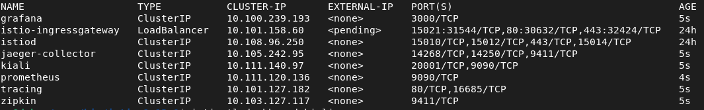
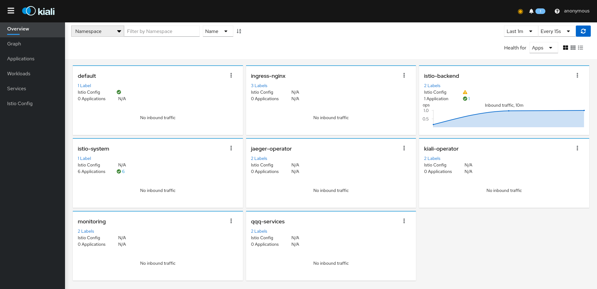
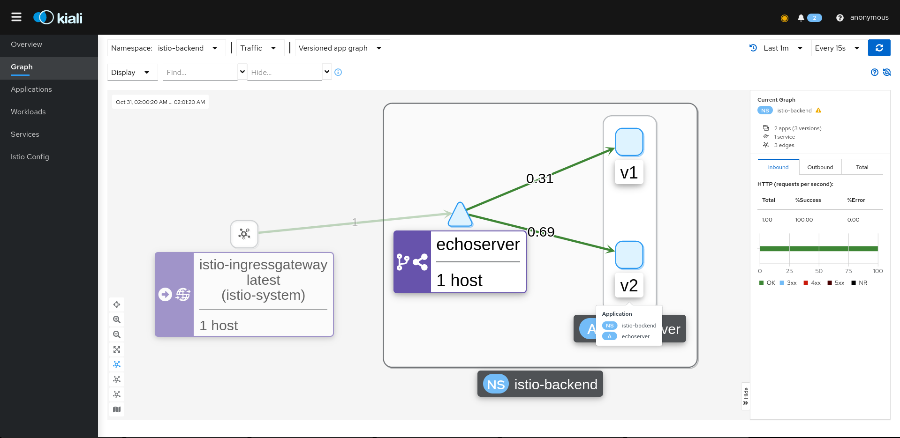

# Домашняя работа к занятию по теме "Service mesh на примере Istio"

## Зависимости

Для выполнения задания вам потребуется установить зависимости:

- [Minikube 1.13.1](https://github.com/kubernetes/minikube/releases/tag/v1.13.1)
- [Kubectl 0.19.2](https://github.com/kubernetes/kubectl/releases/tag/v0.19.2)
- [Istioctl 1.7.3](https://github.com/istio/istio/releases/tag/1.9.0)
- [Heml 3.3.4](https://github.com/helm/helm/releases/tag/v3.3.4)

## Содержание

* [Задачи](#Задачи)
* [Инструкция по выполнению задания](#Инструкция-по-выполнению-задания)
* [Лайфхаки по выполнению задания](#Лайфхаки-по-выполнению-задания)

## Задачи

Задание состоит из этапов

- Развернуть Minikube
- Развернуть Istio c Ingress gateway
- Развернуть две версии приложения с использованием Istio
- Настроить балансировку трафика между версиями приложения на уровне Gateway 50% на 50%
- Сделать снимок экрана с картой сервисов в Kiali с примеров вызова двух версии сервиса

## Инструкция по выполнению задания

- Сделать форк этого репозитория на Github
- Выполнить задание в отдельной ветке
- Создать Pull request с изменениями в этот репозиторий


## Развертывание решения

### Предварительная подготовка
Для выполнения задания вам потребуется скачать релиз istio со всеми необходимыми зависимостями внутри:

https://github.com/istio/istio/releases/tag/1.13.0

- После скачивания релиза Istio необходимо добавить каталог в переменные окружения ./istio-1.13.0/bin

- Устанавливаем istio
~~~
istioctl install
~~~

### Устанавливаем дополнения
- Переходим в каталог ./istio-1.13.0

~~~
kubectl apply -f samples/addons
~~~

- Проверяем корректность установки
```bash
kubectl get services -n istio-system
```



### Выполняем развертывание проекта

```bash
kubectl apply -f namespaces.yaml
kubectl apply -f ./manifests
```


### Тестирование

#### Нагружаем приложение
```bash
kubectl -n istio-system get services
```


Смотрим IP для "istio-ingressgateway"
```
istio-ingressgateway   LoadBalancer   10.101.158.60    <pending>     15021:31544/TCP,80:30632/TCP,443:32424/TCP   24h
```

```bash
minikube ssh
```

В нем выполняем запросы для создания "нагрузки" по IP для "istio-ingressgateway"
```bash
watch -n 1 curl 10.101.158.60
```

#### Проверяем результат в консоле kiali

Для открытия дашборда в браузере выполняем
```bash
istioctl dashboard kiali
```




