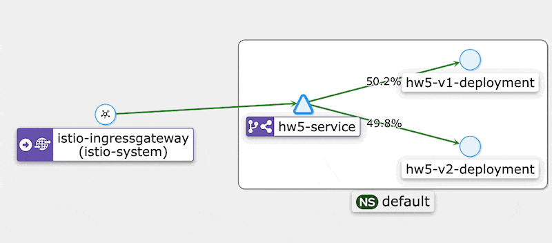

Запуск производился через Docker Desktop на Mac с M1. Из-за невозможности смены версии Kubernates в Docker Desktop
использовались последние версии компонентов.



### Создание namespace'ов:
```shell
kubectl apply -f namespaces.yaml
```

### Установка Cert Manager
```shell
helm repo add jetstack https://charts.jetstack.io
helm repo update
helm install \
  cert-manager jetstack/cert-manager \
  --namespace cert-manager \
  --create-namespace \
  --set installCRDs=true
```

### Установка Istio:
```shell
istioctl install --set profile=default -y
istioctl operator init --watchedNamespaces istio-system --operatorNamespace istio-operator
kubectl apply -f istio/istio.yaml
kubectl apply -f istio/defaults.yaml
```

### Установка Jaeger
```shell
helm repo add jaegertracing https://jaegertracing.github.io/helm-charts
helm repo update
helm install -n jaeger-operator -f jaeger/operator-values.yaml jaeger-operator jaegertracing/jaeger-operator
kubectl apply -f jaeger/jaeger.yaml
```

### Установка Prometheus
```shell
helm repo add prometheus-community https://prometheus-community.github.io/helm-charts
helm repo add stable https://charts.helm.sh/stable
helm repo update
helm install \
	-n monitoring \
	-f prometheus/operator-values.yaml prometheus prometheus-community/kube-prometheus-stack \
	--set prometheus-node-exporter.hostRootFsMount.enabled=false
kubectl apply -f prometheus/monitoring-nodeport.yaml
```

### Установка Kiali

```shell
helm repo add kiali https://kiali.org/helm-charts
helm repo update
helm install \
    --set cr.create=true \
    --set cr.namespace=istio-system \
    --namespace kiali-operator \
    --create-namespace \
     -f kiali/operator-values.yaml \
    kiali-operator \
    kiali/kiali-operator
kubectl apply -f kiali/kiali.yaml
```

### Установка приложения и нагрузка его запросами
```shell
kubectl patch namespace default --patch-file app/namespace.yaml 
kubectl apply -f app/
```
