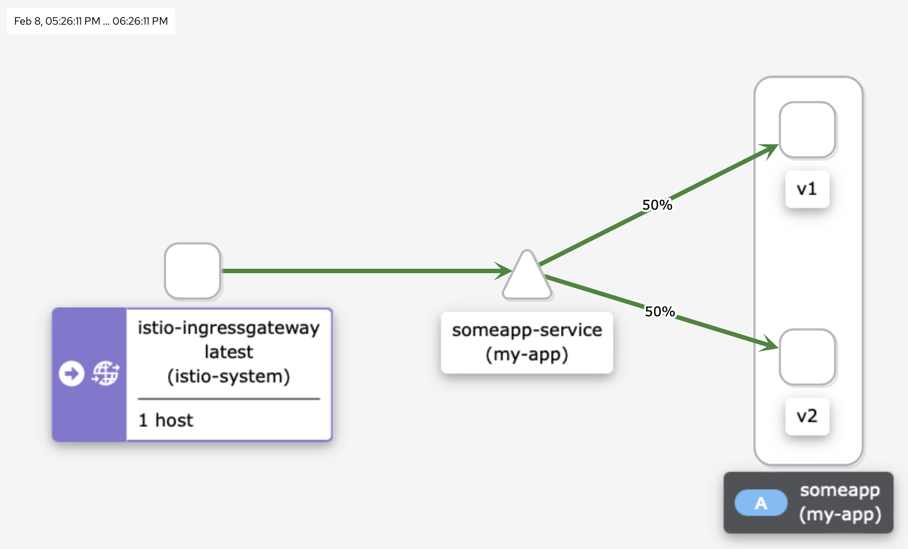

# Практика к занятию по теме "Service mesh на примере Istio"

## Ставим istio (используем istioctl версии 1.12)
```shell
istioctl install --set profile=default -y
```

## Ставим prometheus stack
```shell
helm repo add prometheus-community https://prometheus-community.github.io/helm-charts
helm repo update
helm install prometheus prometheus-community/kube-prometheus-stack --version 32.0.0 --namespace monitoring --create-namespace
kubectl apply -f https://raw.githubusercontent.com/istio/istio/release-1.12/samples/addons/prometheus.yaml
```

## Ставим kiali
```shell
helm repo add kiali https://kiali.org/helm-charts
helm repo update
helm install --set auth.strategy="anonymous" kiali-server kiali/kiali-server --version 1.46.0 --namespace istio-system
kubectl apply -f https://raw.githubusercontent.com/istio/istio/release-1.12/samples/addons/kiali.yaml
```

## Применяем k8s манифесты
```shell
kubectl apply -f ./manifests/
```

## Выполняем несколько запросов в IngressGateway (для minikube)
### Получаем nodePort
```shell
kubectl get service istio-ingressgateway --namespace istio-system -o jsonpath='{.spec.ports[?(@.name=="http2")].nodePort}'
```
### Добавляем роут на хост-машине к сервису
```shell
minikube tunnel
```
### Открываем в браузере `ip:nodePort`
Видим дефолтную страницу nginx. Несколько раз обновляем страницу.

## Переходим в kiali, смотрим Dashboard
```shell
istioctl dashboard kiali
```
