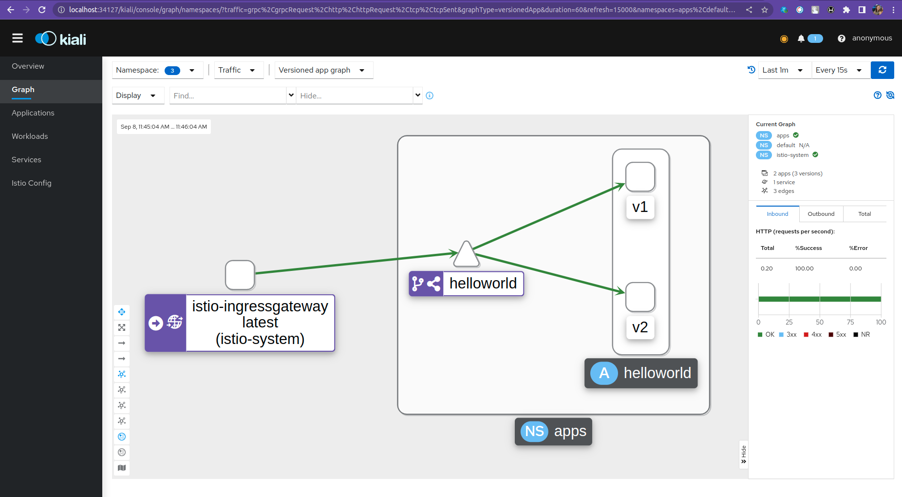

# Практика к занятию по теме "Service mesh на примере Istio"

## Зависимости

Для выполнения задания вам потребуется установить зависимости:

- [Minikube 1.13.1](https://github.com/kubernetes/minikube/releases/tag/v1.13.1)
- [Kubectl 0.19.2](https://github.com/kubernetes/kubectl/releases/tag/v0.19.2)
- [Istioctl 1.14.3](https://github.com/istio/istio/releases/tag/1.14.3)
- [Heml 3.3.4](https://github.com/helm/helm/releases/tag/v3.3.4)

## Задачи

Задание состоит из этапов

- Развернуть Minikube
- Развернуть Istio c Ingress gateway
- Развернуть две версии приложения с использованием Istio
- Настроить балансировку трафика между версиями приложения на уровне Gateway 50% на 50%
- Сделать снимок экрана с картой сервисов в Kiali с примеров вызова двух версии сервиса


## Инструкция по выполнению задания

- Сделать форк этого репозитория на Github
- Выполнить задание в отдельной ветке
- Создать Pull request с изменениями в этот репозиторий
- 
---
Запускаем миникуб 

```shell script
minikube -p minikube2 start --driver virtualbox --cpus=4 --memory=8g --cni=flannel --kubernetes-version="v1.19.0"
```


Устанавливаем Istio

```shell script
curl -L https://istio.io/downloadIstio | ISTIO_VERSION=1.14.3 TARGET_ARCH=x86_64 sh -
cd istio-1.14.3/
export PATH=$PWD/bin:$PATH
istioctl install
kubectl apply -f samples/addons
```

Проверим что все работает

```shell script
kubectl get services -n istio-system
```

Открываем dashboard Kiali

```shell script
istioctl dashboard kiali
```

---

Развернем 2 версии нашего приложения

```shell script
kubectl apply -f manifests
```

Проверим что все работает

```shell script
kubectl get services -n apps
```

---

Получаем адрес по которому живет ingressgateway
```shell script
minikube ip
kubectl -n istio-system get service istio-ingressgateway -o jsonpath='{.spec.ports[?(@.name=="http2")].nodePort}'
```


Нагрудаем приложение
```shell script
watch -n 1 curl {minikube_ip}:{ingressgateway_port}
```


