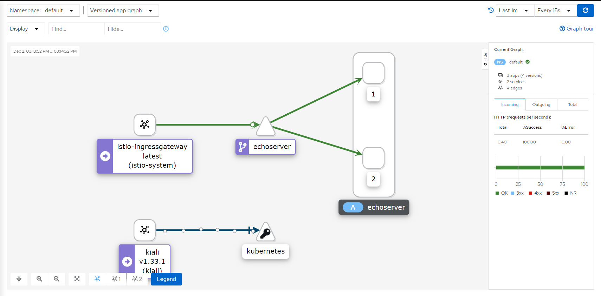

# Практика к занятию по теме "Service mesh на примере Istio"

## Задачи

Задание состоит из этапов

- Развернуть Minikube

```shell script
minikube start --driver hyperv --cpus=4 --memory=6g --cni=flannel --kubernetes-version="v1.19.0"
```

- Развернуть Istio c Ingress gateway

Создаем неймспейсы
```shell script
kubectl apply -f namespaces.yaml
```

Устанавливаем и разворачиваем jaeger и prometheus

```shell script
helm install --version "2.19.0" -n jaeger-operator -f jaeger/operator-values.yaml jaeger-operator jaegertracing/jaeger-operator
kubectl apply -f jaeger/jaeger.yaml
helm install --version "13.7.2" -n monitoring -f prometheus/operator-values.yaml prometheus prometheus-community/kube-prometheus-stack
kubectl apply -f prometheus/monitoring-nodeport.yaml
```

Разворачиваем и настраиваем Istio

```shell script
istioctl operator init --watchedNamespaces istio-system --operatorNamespace istio-operator
kubectl apply -f istio/istio.yaml
kubectl apply -f istio/disable-mtls.yaml
```

Устанавливаем и разворачиваем Kiali

```shell script
helm install --version "1.33.1" -n kiali-operator -f kiali/operator-values.yaml kiali-operator kiali/kiali-operator
kubectl apply -f kiali/kiali.yaml
```

- Развернуть две версии приложения с использованием Istio

Разворачиваем две версии `echoserver`

Собрать Docker-образ:

```shell script
eval $(minikube docker-env) && docker build -t proxy-app:latest -f app/src/Dockerfile app/src
```

Развернуть приложение `echoserver` в кластере:

```shell script
kubectl apply -f app/echoserver.yaml
```

- Настроить балансировку трафика между версиями приложения на уровне Gateway 50% на 50%

```shell script
kubectl apply -f .\istio\gateway.yaml
```

- Сделать снимок экрана с картой сервисов в Kiali с примеров вызова двух версии сервиса


## Инструкция по выполнению задания

- Сделать форк этого репозитория на Github
- Выполнить задание в отдельной ветке
- Создать Pull request с изменениями в этот репозиторий

## Лайфхаки по выполнению задания

Для выполнения задания вы можете воспользоваться [материалами демо](https://github.com/izhigalko/otus-demo-istio).

---

Спецификацию IstioOperator можно посмотреть
[в документации Istio](https://istio.io/latest/docs/reference/config/istio.operator.v1alpha1/#IstioOperatorSpec)
или можно посмотреть [исходники манифестов, исполняемых оператором](https://github.com/istio/istio/tree/master/manifests).

---

Если вы хотите изменить текущую конфигурацию Istio,
достаточно применить манифест с указанием конфигурации:

```shell script
kubectl apply -f istio/istio-manifest.yaml
```

---

Для выключения шифрования между прокси, нужно применить настройку:

```shell script
kubectl apply -f istio/defaults.yaml
```

---

Для доступа к какому-либо сервису с хоста можно использовать тип NodePort в сервисе:

```yaml
---
apiVersion: v1
kind: Service
metadata:
  name: test
  namespace: default
spec:
  type: NodePort
  ports:
    - port: 80
      nodePort: 32080
      targetPort: 8080
  selector:
    app: test
```

Использовать специальную команду для доступа к сервису:

```yaml
minikube service -n <namespace> <service>
```
