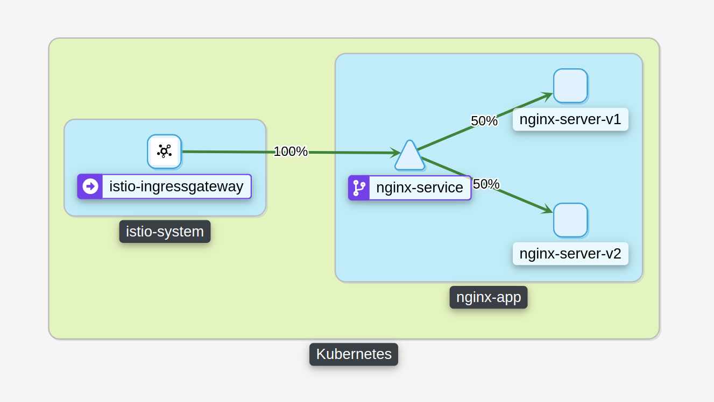

# Практика к занятию по теме "Service mesh на примере Istio"
Запустить кластер в minilube:
```shell
minikube start --cpus=4 --memory=4000m
```
Установить istio:
```shell 
istioctl install --set profile=demo -y
```

Установить prometheus :
```shell 
helm install --version "36.6.0" prometheus prometheus-community/kube-prometheus-stack --namespace prometheus --create-namespace
```
```shell 
kubectl apply -f https://raw.githubusercontent.com/istio/istio/release-1.14/samples/addons/prometheus.yaml
```

Установить kiali:
```shell 
helm install --version "1.53.0" kiali-operator kiali/kiali-operator --namespace istio-system
```
```shell 
kubectl apply -f https://raw.githubusercontent.com/istio/istio/release-1.14/samples/addons/kiali.yaml
```

Развернуть сервис:
```shell 
kubectl apply -f ./manifests/
```

Проверить, что все объекты развернуты и готоры к работе:
```shell 
kubectl get all -n nginx-app
```

Определить nodePort и ip для ingress gateway:
```shell 
kubectl -n istio-system get service istio-ingressgateway -o jsonpath='{.spec.ports[?(@.name=="http2")].nodePort}'
```
```shell 
  minikube ip
```

Запустить выполнение запросов к ingress по адресу определенному выше:
```shell
while true; do sleep 1; curl [ip]:[nodePort]; done
```

Открыть дашборд kiali и посмотреть на схему:
```shell 
istioctl dashboard kiali
```

# Результат

