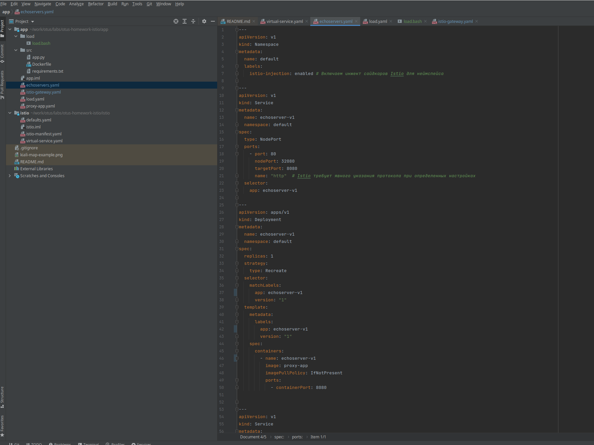
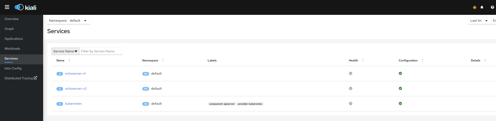
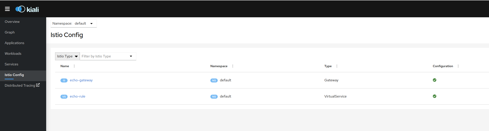
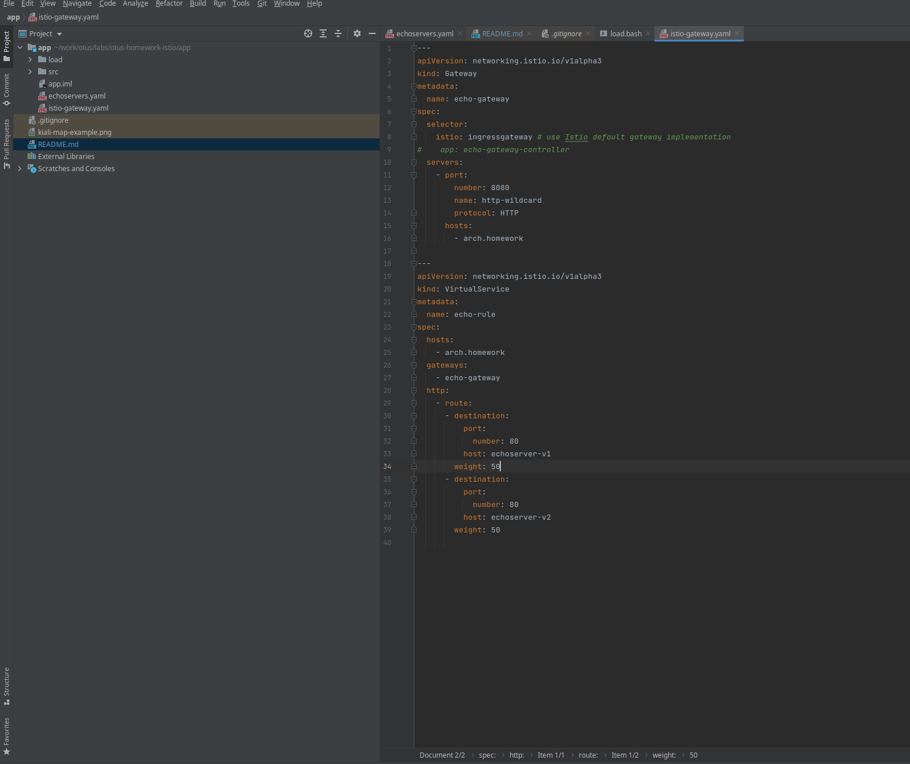
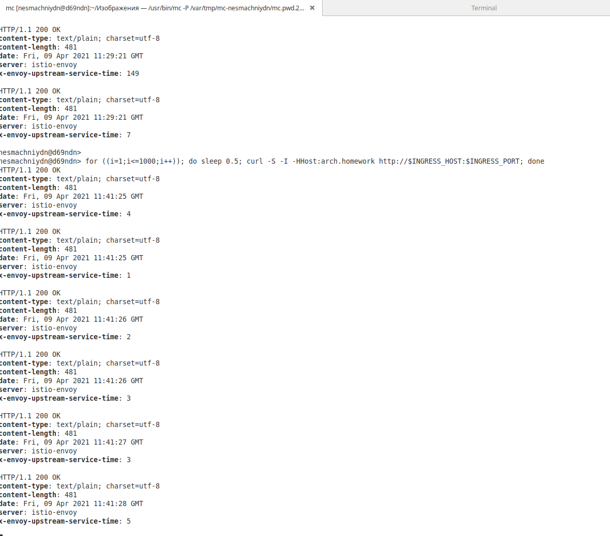
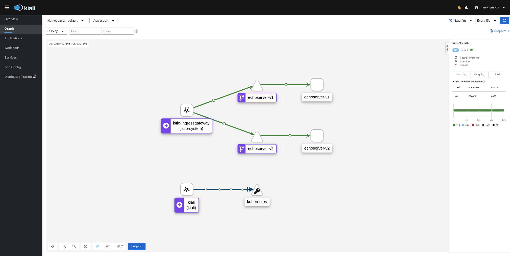

# Практика к занятию по теме "Service mesh на примере Istio"
Задание состоит из этапов
1) Развернуть Minikube
2) Развернуть Istio c Ingress gateway
3) Развернуть две версии приложения с использованием Istio
4) Настроить балансировку трафика между версиями приложения на уровне Gateway 50% на 50%
5) Сделать снимок экрана с картой сервисов в Kiali с примеров вызова двух версии сервиса

1) Для выполнения задания в кластере Кубернетес развернуты 2 версии одного и того-же приложения Echoserver

перечень сервисов в Истио
   

Конфигурация в Истио
   
   

2) В Istio создан манифест на IstioGateway и заданы правила балансировки трафика в VirtualService
   

3) Разработан скрипт, подающий нагрузку на входной ендпоинт gateway

4) Скрипт запущен и работает
   

5) На дашборде kiali с включенной визуализацией traffic Animation отображается прохождение сообщений и распределение потоков  в соответствии с заданными процентами весов
   