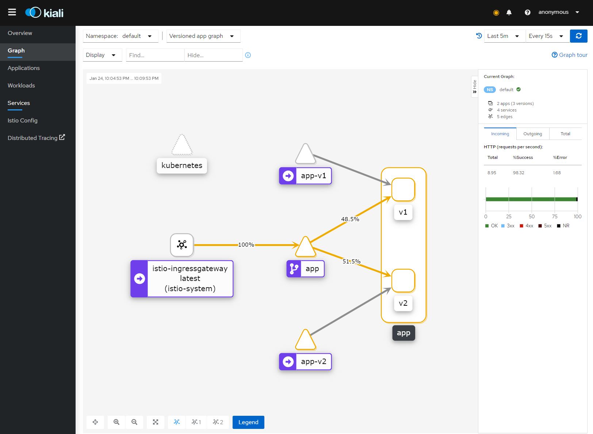

# Ветки

- [main (demo)](https://github.com/reomor/otus-homework-istio/tree/main)
- [hw](https://github.com/reomor/otus-homework-istio/tree/reomor)

# Задание

[Условие задания](./TASK.md)

Порядок запуска

```shell
kubectl apply -f ./k8s/app-v1.yaml
kubectl apply -f ./k8s/app-v2.yaml
kubectl apply -f ./k8s/service.yaml
kubectl apply -f ./k8s/gateway-with-balancing.yaml
```

Карта распределения запросов


Вспомогательные команды

```shell
docker build -t istio-app:v1 -f app-v1/src/Dockerfile app-v1/src
curl -HHost:app.default.svc.cluster.local http://192.168.101.134:30794
siege -c 50 -t 10S -H "Host:app.default.svc.cluster.local" http://192.168.101.134:30794/   
```

[Включение LoadBalancing в minikube](https://medium.com/faun/metallb-configuration-in-minikube-to-enable-kubernetes-service-of-type-loadbalancer-9559739787df)
