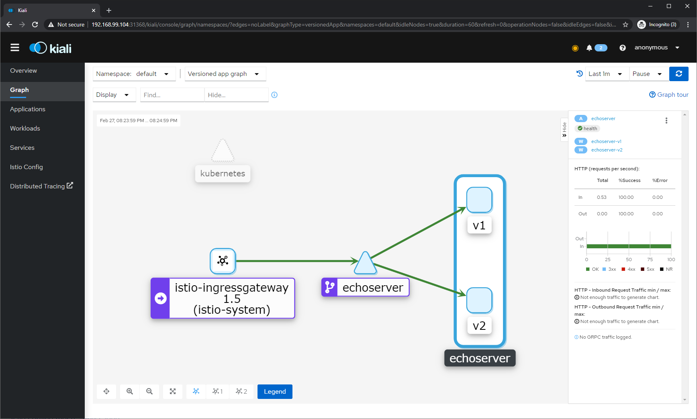

- Настроил по примеру связку без графаны - istio, jaeger, prometheus, kiali.
- Воспользовался приложением из примера, создал две версии в докере. Настроил манифест для приложения.
- Настроил шлюз и сервис для istio.

