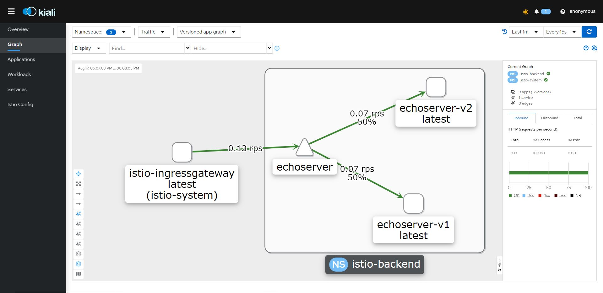

# Домашняя работа к занятию по теме "Service mesh на примере Istio"

## Зависимости

Для выполнения задания вам потребуется скачать релиз istio со всеми необходимыми зависимостями внутри:

https://github.com/istio/istio/releases/tag/1.14.3

## Содержание

* [Задачи](#Задачи)
* [Инструкция по выполнению задания](#Инструкция-по-выполнению-задания)
* [Лайфхаки по выполнению задания](#Лайфхаки-по-выполнению-задания)

## Задачи

Задание состоит из этапов

- Развернуть Minikube
- Развернуть Istio c Ingress gateway
- Развернуть две версии приложения с использованием Istio
- Настроить балансировку трафика между версиями приложения на уровне Gateway 50% на 50%
- Сделать снимок экрана с картой сервисов в Kiali с примеров вызова двух версии сервиса

## Инструкция по выполнению задания

- Сделать форк этого репозитория на Github
- Выполнить задание в отдельной ветке
- Создать Pull request с изменениями в этот репозиторий

## Для запуска проекта потребуется

- Разворачиваем minikube в Docker Desctop под Windows, ставим Istio версии 1.14

- После скачивания релиза Istio заходим в папку istio-1.14.3-win\istio-1.14.3\bin и прописываем istioctl в path 

- Устанавливаем istio командой: 
  ~~~~
  istioctl install
  ~~~~

- Переходим в папку со скаченным релизом: **cd АДРЕС_ДО_РЕЛИЗА\istio-1.14.3-win\istio-1.14.3**

- Устанавливаем аддоны: 
  ~~~~
  kubectl apply -f samples/addons
  ~~~~

- Проверяем, что все корректно работает

  ~~~~
  kubectl get services -n istio-system
  ~~~~
  
  ~~~~
  kubectl get services -n istio-system
  ~~~~
  
- Пробрасываем все необходимые порты, например kiali
  ~~~~
  kubectl port-forward service/kiali   20001:20001 -n istio-system
  ~~~~
  
- Создаем namespace
   ~~~~
   kubectl create namespace istio-backend
   ~~~~
  
- Переходим в папку проекта manifests: **cd "АДРЕС_ДО_ПРОЕКТА\otus-homework-istio\manifests"**. 
  Предварительно с помощью Dockerfile из папки **otus-homework-istio\app\src** был сделан образ echoservice и залит на DockerHub.
- Применяем манифесты

  ~~~~
  kubectl apply -f .  
  ~~~~
  
 - Нагружаем приложение http://localhost/ трафиком
 
 - Переходим в kiali и видим граф 
  
  