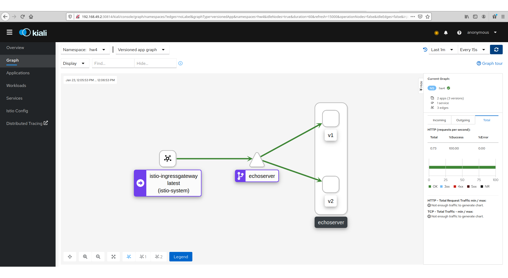

# Практика к занятию по теме "Service mesh на примере Istio"

## Зависимости

Для выполнения задания вам потребуется установить зависимости:

- [VirtualBox](https://www.virtualbox.org/wiki/Downloads)
- [Vagrant](https://www.vagrantup.com/downloads.html)

После установки нужно запустить команду запуска в корне проекта:

```shell script
vagrant up
```

Для совершения всех операций нам понадобится зайти в виртуальную машину:

```shell script
vagrant ssh
```

## Содержание

* [Задачи](#Задачи)
* [Инструкция по выполнению задания](#Инструкция-по-выполнению-задания)
* [Лайфхаки по выполнению задания](#Лайфхаки-по-выполнению-задания)

## Задачи

Задание состоит из этапов

- Развернуть Istio с включенными метриками сервисов и Kiali
- Развернуть минимум два приложения с Service mesh и сделать к ним несколько запросов
- Отобразить карту сервисов в Kiali

Карта сервисов в Kiali выглядит таким образом:


## Инструкция по выполнению задания

- Сделать форк этого репозитория на Github
- Выполнить задание в отдельной ветке
- Создать Pull request с изменениями в этот репозиторий


## Лайфхаки по выполнению задания

Для выполнения задания вы можете воспользоваться [материалами демо](https://github.com/izhigalko/otus-demo-istio).

Спецификацию IstioOperator можно посмотреть
[в документации Istio](https://istio.io/latest/docs/reference/config/istio.operator.v1alpha1/#IstioOperatorSpec)
или можно посмотреть [исходники манифестов, исполняемых оператором](https://github.com/istio/istio/tree/1.6.4/manifests).

Директория `istio` в корне проекта расшарена в виртуальную машину, вы можете изменять файлы 
в любимом редакторе и применять их в консоли виртуальной машины.

Если вы хотите изменить текущую конфигурацию Istio,
достаточно снова выполнить соответствующую команду с указанием конфигурации:

```shell script
istioctl manifest apply -f istio/istio-manifest.yaml
```

Для выключения шифрования между прокси, нужно применить настройку:

```shell script
kubectl apply -f istio/defaults.yaml
```

Для доступа к какому-либо сервису с хоста можно использовать тип NodePort в сервисе:

```yaml
---
apiVersion: v1
kind: Service
metadata:
  name: test
  namespace: default
spec:
  type: NodePort
  ports:
    - port: 80
      nodePort: 32080
      targetPort: 8080
  selector:
    app: test
```

И сделать его проброс с помощью дополнительного флага
при подключении к виртуальной машине по ssh. Проброс портов заканчивается при завершении этой ssh сессии:

```yaml
vagrant ssh -- -L 32000:localhost:32080
```

Здесь `32080` - порт виртуальной машины, `32000` - порт хоста.
Сервис будет доступен по адресу `localhost:32000`.


## Выполнение задания

1. На основе инструкции по ссылке https://github.com/izhigalko/otus-demo-istio/tree/minikube
был развернут Jaeger, Prometheus, Istio, Kiali. При установке kiali-operator версии 1.22.0
pod kiali не стартовал. Ошибку запуска исправила установка kiali-operator версии 1.27.0.
2. В качетсве исполняемого приложения был взят echoserver. echoserver.yaml был отредактирован
для создания 2-х версий приложения. Запускаем в кластере с помощью команды:
```shell script
   kubectl apply -f ./app/echoserver.yaml
```
3. Для получения доступа к приложению из браузера на хосте создаем Gateway. Для роутинга
входящего траффика 50/50 для различных версий приложения создаем VirtualService и DestinationRule.
Описания приведены в файле ./istio/route_by_weight.yaml. Создаем объекты в кластере с помощью команды:
```shell script
   kubectl apply -f ./istio/route_by_weight.yaml
```
4. Теперь можно отправить запрос и посмотреть результат с помощью браузера на хосте. Чтобы узнать адрес
можно выполнить следующие команды и использовать значение, выведенное для перменной $GATEWAY_URL.
```shell script
   export INGRESS_PORT=$(kubectl -n istio-system get service istio-ingressgateway -o jsonpath='{.spec.ports[?(@.name=="http2")].nodePort}')
   export SECURE_INGRESS_PORT=$(kubectl -n istio-system get service istio-ingressgateway -o jsonpath='{.spec.ports[?(@.name=="https")].nodePort}')
   export TCP_INGRESS_PORT=$(kubectl -n istio-system get service istio-ingressgateway -o jsonpath='{.spec.ports[?(@.name=="tcp")].nodePort}')
   export INGRESS_HOST=$(minikube ip)
   export GATEWAY_URL=$INGRESS_HOST:$INGRESS_PORT
   echo $GATEWAY_URL
```
5. После создания нагрузки был снят скриншот в Kiali.

