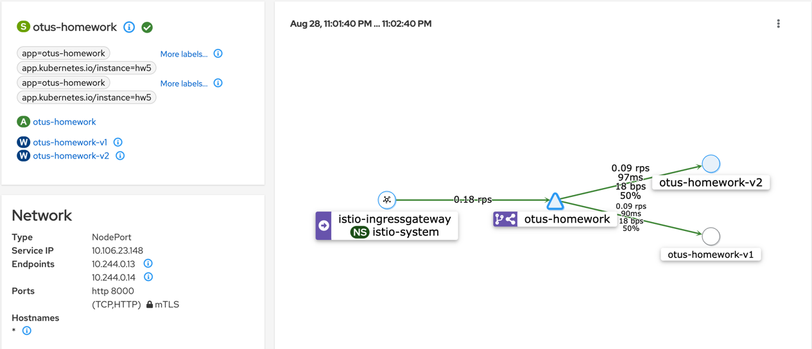

# Практика к занятию по теме "Service mesh на примере Istio"

## Запуск minikube
```shell
minikube start
```

## Установка istio
```shell
istioctl install --set profile=demo -y
```

## Установка kialy
```shell
helm repo add kiali https://kiali.org/helm-charts
helm repo update
helm install \
  --set cr.create=true \
  --set cr.namespace=istio-system \
  --namespace kiali-operator \
  --create-namespace \
  kiali-operator \
  kiali/kiali-operator
```

```shell
kubectl apply kiali-cr.yaml -n istio-system
```

## Установка prometheus
```
kubectl apply -f https://raw.githubusercontent.com/istio/istio/release-1.14/samples/addons/prometheus.yaml
```

## Запуск приложения (все запустится в namespace 'default')
```shell
kubectl apply -f manifest.yaml
```

## Доступ к kiali
```shell
istioctl dashboard kiali
```

## Выполнение запросов
```shell
minikube ip # запоминаем <ip>
kubectl -n istio-system get service istio-ingressgateway -o jsonpath='{.spec.ports[?(@.name=="http2")].nodePort}' # запоминаем <port>
while true; do sleep 1; curl <ip>:<nodePort>; done # выполняем запросы
```

## Схема kialy


