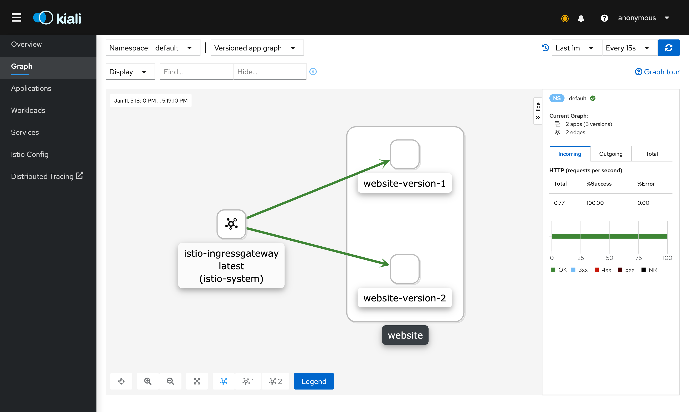

# Домамшнее задание Service Mesh & Istio
## Выполнил Mironov Sergei

## Описание
Для выполнения задания я воспользовался proxy приложением, которое использовалось на demo: 
* подготовил 2 версии этого приложения - файл deployment.yaml;
* настроил Gateway на основе Istio Ingress - файл website-routing.yaml;
* настроил VirtualService (с указанием веса балансировки 50%) & DestinationRule - файл website-routing.yaml.

## Скриншоты

