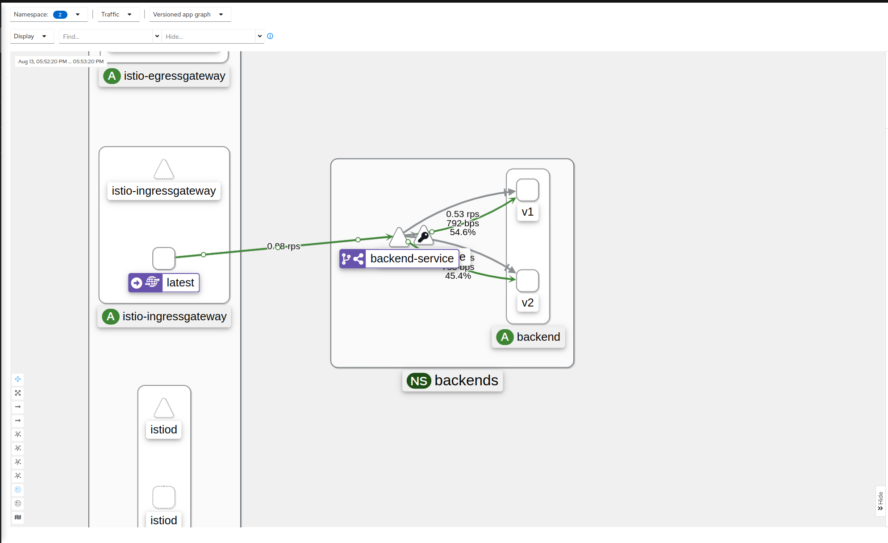

# Практика к занятию по теме "Service mesh на примере Istio"

## Зависимости

- Minikube 1.26.1
- Kubectl 1.24.3
- Istioctl 1.13.0
- Heml 3.9.3

## Hometask

Создаем namespaces:

```
kubectl apply -f namespaces.yaml
```

Разворачиваем Istio

```
istioctl install --set profile=demo -y
```

Ставим kiali

```
helm repo add kiali https://kiali.org/helm-charts
helm repo update
helm install -n kiali-operator kiali-operator kiali/kiali-operator
kubectl apply -f kiali/kiali.yaml
```

Ставим prometheus

```
kubectl apply -f https://raw.githubusercontent.com/istio/istio/release-1.14/samples/addons/prometheus.yaml
```

Ставим приложение

```
kubectl apply -f manifests
```

Определяем внешний адрес миникуба

```
$ kubectl -n istio-system get services                                                                                                                    ✔  minikube ⎈
NAME                   TYPE           CLUSTER-IP       EXTERNAL-IP     PORT(S)                                                                      AGE
istio-egressgateway    ClusterIP      10.99.62.218     <none>          80/TCP,443/TCP                                                               2m13s
istio-ingressgateway   LoadBalancer   10.101.39.126    10.101.39.126   15021:31684/TCP,80:31430/TCP,443:31405/TCP,31400:32066/TCP,15443:32169/TCP   2m13s
istiod                 ClusterIP      10.111.225.17    <none>          15010/TCP,15012/TCP,443/TCP,15014/TCP                                        2m27s
kiali                  ClusterIP      10.104.131.115   <none>          20001/TCP,9090/TCP                                                           53s
prometheus             ClusterIP      10.104.218.132   <none>          9090/TCP                                                                     80s
```

Проверяем работу приложения

```
$ curl 10.101.39.126                                                                                                                                                   ✔
<!DOCTYPE html>
<html>
<head>
<title>Welcome to nginx!</title>
<style>
html { color-scheme: light dark; }
body { width: 35em; margin: 0 auto;
font-family: Tahoma, Verdana, Arial, sans-serif; }
</style>
</head>
<body>
<h1>Welcome to nginx!</h1>
<p>If you see this page, the nginx web server is successfully installed and
working. Further configuration is required.</p>

<p>For online documentation and support please refer to
<a href="http://nginx.org/">nginx.org</a>.<br/>
Commercial support is available at
<a href="http://nginx.com/">nginx.com</a>.</p>

<p><em>Thank you for using nginx.</em></p>
</body>
</html>
```

Начинаем слать запросы

```
$ watch -n 1 curl 10.101.39.126
```

Смотрим дашборд kiali

```
istioctl dashboard kiali
```

