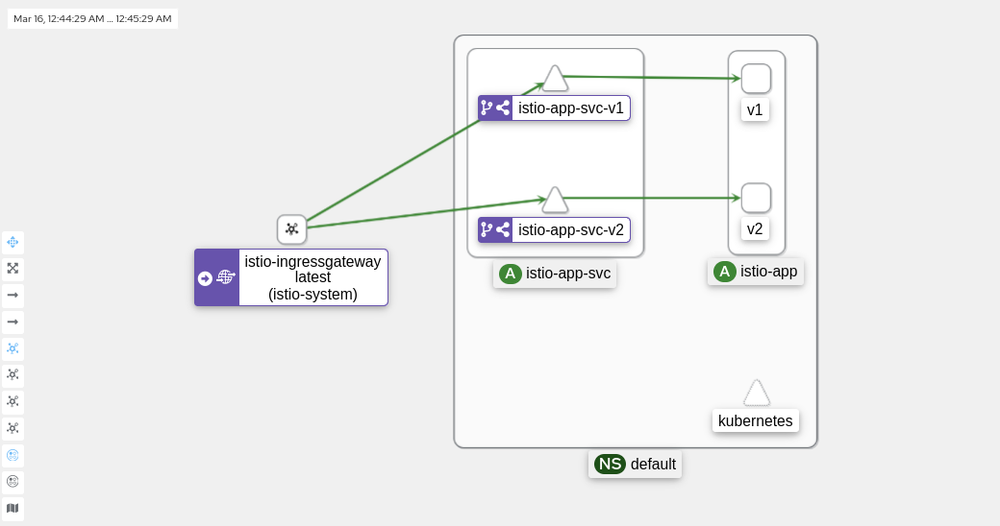

# Практика к занятию по теме "Service mesh на примере Istio"

## Зависимости

Для выполнения задания вам потребуется установить зависимости:

- [Minikube 1.13.1](https://github.com/kubernetes/minikube/releases/tag/v1.13.1)
- [Kubectl 0.19.2](https://github.com/kubernetes/kubectl/releases/tag/v0.19.2)
- [Istioctl 1.7.3](https://github.com/istio/istio/releases/tag/1.9.0)
- [Heml 3.3.4](https://github.com/helm/helm/releases/tag/v3.3.4)

## Содержание

* [Задачи](#Задачи)
* [Инструкция по выполнению задания](#Инструкция-по-выполнению-задания)
* [Лайфхаки по выполнению задания](#Лайфхаки-по-выполнению-задания)

## Задачи

Задание состоит из этапов

- Развернуть Minikube
- Развернуть Istio c Ingress gateway
- Развернуть две версии приложения с использованием Istio
- Настроить балансировку трафика между версиями приложения на уровне Gateway 50% на 50%
- Сделать снимок экрана с картой сервисов в Kiali с примеров вызова двух версии сервиса


## Инструкция по выполнению задания

- Сделать форк этого репозитория на Github
- Выполнить задание в отдельной ветке
- Создать Pull request с изменениями в этот репозиторий

## Лайфхаки по выполнению задания

Для выполнения задания вы можете воспользоваться [материалами демо](https://github.com/izhigalko/otus-demo-istio).

---

Спецификацию IstioOperator можно посмотреть
[в документации Istio](https://istio.io/latest/docs/reference/config/istio.operator.v1alpha1/#IstioOperatorSpec)
или можно посмотреть [исходники манифестов, исполняемых оператором](https://github.com/istio/istio/tree/master/manifests).

---

Если вы хотите изменить текущую конфигурацию Istio,
достаточно применить манифест с указанием конфигурации:

```shell script
kubectl apply -f istio/istio-manifest.yaml
```

---

Для выключения шифрования между прокси, нужно применить настройку:

```shell script
kubectl apply -f istio/defaults.yaml
```

---

Для доступа к какому-либо сервису с хоста можно использовать тип NodePort в сервисе:

```yaml
---
apiVersion: v1
kind: Service
metadata:
  name: test
  namespace: default
spec:
  type: NodePort
  ports:
    - port: 80
      nodePort: 32080
      targetPort: 8080
  selector:
    app: test
```

Использовать специальную команду для доступа к сервису:

```yaml
minikube service -n <namespace> <service>
```

## Результат выполнения задания

Чтобы развернуть сервис с балансировкой трафика пополам между двух версий требуется сначала создать namespace:

```shell
kubectl apply -f ./app/namespace.yaml
```

И развернуть приложение командой: 
```shell
kubectl apply -f ./app/
```

Результат выполнения представлен на скриншоте из kiali


