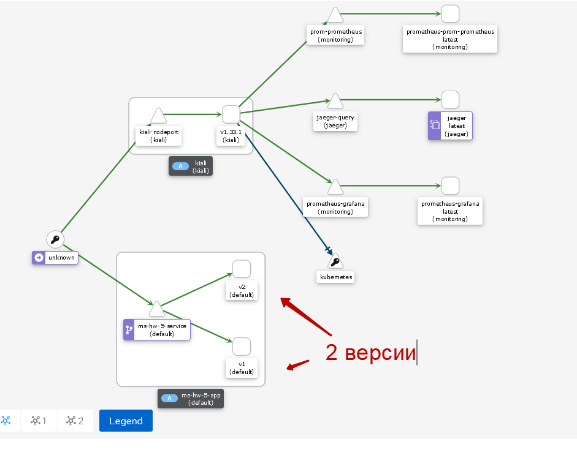

# Домашняя работа "Service mesh на примере Istio"

## Зависимости

Для выполнения задания использовались следующие зависимости:

- [Minikube 1.29.0](https://github.com/kubernetes/minikube/releases/tag/v1.29.0)
- [Kubectl 0.26.1](https://github.com/kubernetes/kubectl/releases/tag/v0.26.1)
- [Istioctl 1.17.0](https://github.com/istio/istio/releases/tag/1.17.0)
- [Heml 3.3.4](https://github.com/helm/helm/releases/tag/v3.3.4)

## Содержание

* [Задачи](#Задачи)
* [Инструкция по выполнению задания](#Инструкция по выполнению задания)


## Задачи

Задание состоит из этапов

- Развернуть Minikube
- Развернуть Istio c Ingress gateway
- Развернуть две версии приложения с использованием Istio
- Настроить балансировку трафика между версиями приложения на уровне Gateway 50% на 50%
- Сделать снимок экрана с картой сервисов в Kiali с примеров вызова двух версии сервиса

## Инструкция по выполнению задания

1. Создаём необходимые неймспейсы:

```shell script
kubectl apply -f namespaces.yaml
```

2. Добавляем необходимые репозитории helm

```shell script
helm repo add jetstack https://charts.jetstack.io
helm repo add stable https://charts.helm.sh/stable
helm repo add prometheus-community https://prometheus-community.github.io/helm-charts
helm repo add jaegertracing https://jaegertracing.github.io/helm-charts
helm repo add kiali https://kiali.org/helm-charts
helm repo update
```

3. Разворачиваем Jaeger

```shell script
helm install --namespace cert-manager cert-manager jetstack/cert-manager --set installCRDs=true
helm install --namespace jaeger-operator jaeger-operator jaegertracing/jaeger-operator -f ./jaeger/operator-values.yaml
kubectl apply -f jaeger/jaeger.yaml
```
```shell script
#Выполняем проверку
kubectl get po -n jaeger -l app.kubernetes.io/instance=jaeger #pod jaeger-* в статусе running
minikube service -n jaeger jaeger-query-nodeport #доступность web-ui jaeger
```

4. Разворачиваем Prometheus + grafana

```shell script
helm install --namespace monitoring  prometheus prometheus-community/kube-prometheus-stack -f ./prometheus/operator-values.yaml --atomic
kubectl apply -f prometheus/monitoring.yaml
```
```shell script
#Выполняем проверку
kubectl get po -n monitoring #pods в статусе running
minikube service -n monitoring prometheus-grafana-nodeport #доступность web-ui grafana
minikube service -n monitoring prom-prometheus-nodeport #доступность web-ui prometheus
```

4. Разворачиваем Istio

```shell script
istioctl operator init
kubectl apply -f ./istio/istio.yaml
```
```shell script
#Выполняем проверку
kubectl get all -n istio-system -l istio.io/rev=default 
```

5. Добавляем аддон Kiali к Istio

```shell script
helm install -n kiali-operator kiali-operator kiali/kiali-operator
kubectl apply -f ./kiali/kiali.yaml
```
```shell script
#Выполняем проверку
kubectl get po -n istio-system -l app.kubernetes.io/name=kiali #pod kiali-* в статусе running
minikube service -n istio-system kiali-nodeport #доступность web-ui kiali
```

5. Разворачиваем две версии приложения

```shell script
kubectl apply -n otus-ms-scala -f ./app/app.yaml
kubectl apply -f ./app/istio-ingress.yaml
```
```shell script
#Выполняем проверку
kubectl get all -n otus-ms-scala
minikube service -n otus-ms-scala hello-service
```

## Результат
