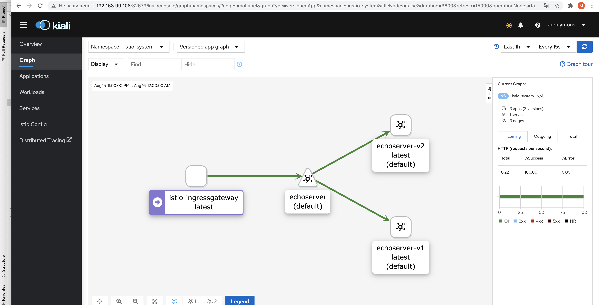

# Istio Homework

## Installing Istio

Enable sidecar injection for namespace `default`:
```
kubectl label namespace default istio-injection=enabled
```

Install Istio with Ingress gateway enabled by running

```
istioctl operator init --watchedNamespaces istio-system --operatorNamespace istio-operator
kubectl create ns istio-system
kubectl apply -f istio/istio-manifest.yaml
```

## Building application

Application simply returns `Hello from app version {version}`, where `{version}` is 
taken from the environment variant `APP_VERSION`.

```shell script
docker build -t udintsev/istio-homework-app:latest app
docker push udintsev/istio-homework-app:latest
```

## Deploying application

Deploy application:

```shell script
kubectl apply -f application.yaml
```

This will create a Service serving two deployments of the same application.
The two deployments differ in the value of the environment variable `APP_VERSION`,
visible to the application container.

Each Deployment and its corresponding Pod are marked with the respective `version` label (`v1` or `v2`).

Make sure the service works by forward the service port and then invoking the service:

```shell script
kubectl port-forward service/istio-homework-app 8080:8080
```

And in a different terminal window:

```shell script
curl -v localhost:8080
```

Stop `port-forward` after you're done (we'll reuse port 8080 later on to forward Istio ingress gateway).

## Istio Resources

```shell script
kubectl apply -f gateway.yaml
```

This will define:

* a `DestinationRule` with two _subsets_ for the Istio host `istio-homework-app` (which is Kubernetes service
defined in the [application.yaml](application.yaml)), each subset addressing its respective
Pod (using the `version` label)
* a `VirtualService` load-balancing traffic between the two _subsets_ in 50-vs-50 proportion
* a `Gateway` serving the VirtualService

Forward Istio ingress gateway port and invoke the service:

```shell script
kubectl port-forward -n istio-system service/istio-ingressgateway 8080:80
```

And in a new terminal window:

```
curl -v localhost:8080
```



References:
* https://istio.io/latest/docs/concepts/traffic-management/#more-about-routing-rules
* https://istio.io/latest/docs/concepts/traffic-management/#destination-rules
* https://istio.io/latest/docs/reference/config/networking/destination-rule/
