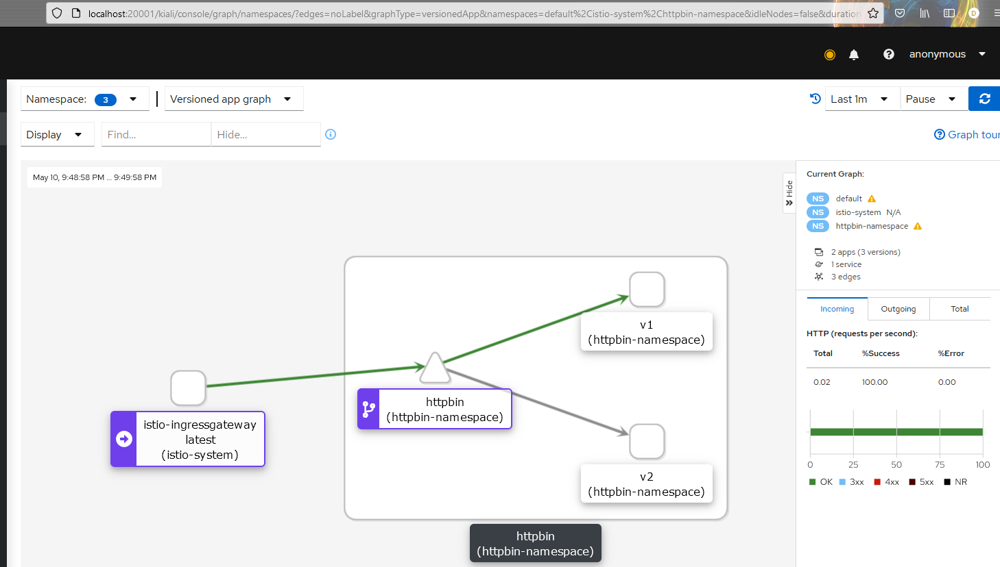

### Istio (Kubernetes)

Установка Ioctl-CLI (необходимо скачать дистибутив Istio):
```shell
istioctl install --set profile=demo;  # Профиль `demo` - конфигурация с минимальными системными требованиями
```
Утсновка дополнений - Kiali, Prometheus, Jaeger <span style="color: red">*</span>:
```shell
kubectl apply -f ./_kube/istio/addons;
```
Установка приложения с использованием `Automatic sidecar injection` <span style="color: red">*</span>:
```shell
kubectl apply -f ./_kube/istio/app;
```
Запуск Kiali-dashboard:
```shell
istioctl dashboard kiali;
```
<span style="color: red">*</span> - Может потребоваться повторное примерения манифестов, т.к они инициализируются независимо друг от друга


### Тестирование с доступом из локального хоста (Minikube)
```shell
$env:INGRESS_PORT=$( kubectl -n istio-system get service istio-ingressgateway -o jsonpath="{.spec.ports[?(@.name == 'http2')].nodePort}" );  # Получить порт шлюза для внешнего доступа по HTTP
$env:INGRESS_HOST=$( minikube ip );
echo "http://$( $env:INGRESS_HOST ):$( $env:INGRESS_PORT )/status/";  # Test request
```


### Результат тестирования в Kiali-dashboard



### Licenses:
* В качестве основы для схемы развертывания использован пример сервиса `httpbin` из официальной документации `Istio` (Apache License 2.0)
  https://istio.io/latest/docs/setup/additional-setup/sidecar-injection/
* Примеры развёртывания (папка `samples/addons`) использованы из официального дистрибутива `Istioctl` без изменений
  https://github.com/istio/istio/releases