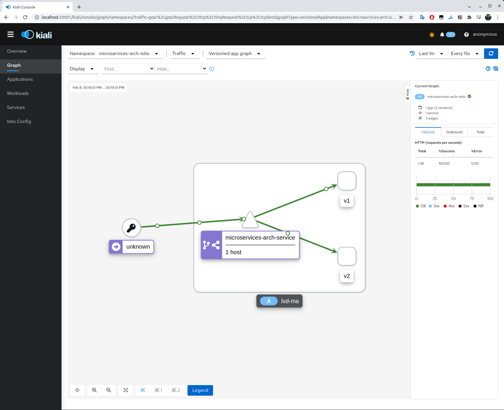

### How to start

1. Run minikube `minikube start --vm-driver=kvm2`
1. Install Istio `istioctl install --set profile=demo -y`
1. `cd otus-homework-istio/homework-lapeevvd`
1. Execute `./setup.sh`

### How to check

1. Start Kiali dashboard `istioctl dashboard kiali`
1. Execute `./check.sh`

