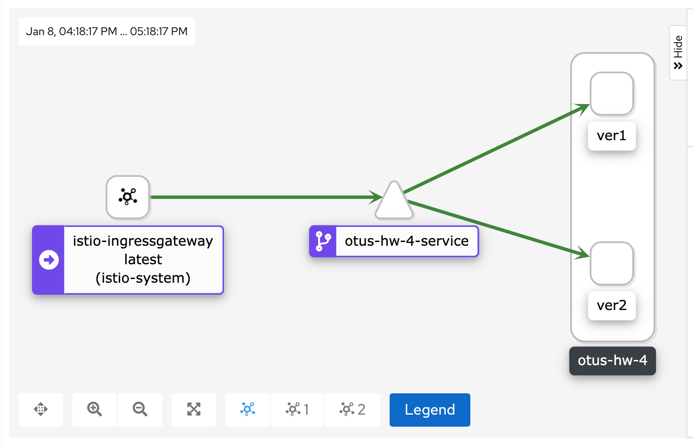

# Выполнение задания
Запустить кластер в миникубе:
`minikube start --driver virtualbox --cpus=4 --memory=4200m --cni=flannel --kubernetes-version="v1.19.0"`

Установить istio:
`istioctl install --set profile=demo -y`

Установить прометеус с графаной :
`helm install --version "13.7.2" prometheus prometheus-community/kube-prometheus-stack`

`kubectl apply -f https://raw.githubusercontent.com/istio/istio/release-1.9/samples/addons/prometheus.yaml`

Установить kiali:
`helm install --version "1.33.1" kiali-operator kiali/kiali-operator`

`kubectl apply -f https://raw.githubusercontent.com/istio/istio/release-1.9/samples/addons/kiali.yaml`

Инжектнуть istio в дефолтный namespace:
`kubectl label namespace default istio-injection=enabled`

Развернуть сервис:
`kubectl apply -f homework/manifests/`

Определить nodePort и ip для ingress gateway:
`kubectl -n istio-system get service istio-ingressgateway -o jsonpath='{.spec.ports[?(@.name=="http2")].nodePort}'`

`minikube ip`

и сделать запросы на них

Открыть дашборд kiali и посмотреть на схему:
`istioctl dashboard kiali`

