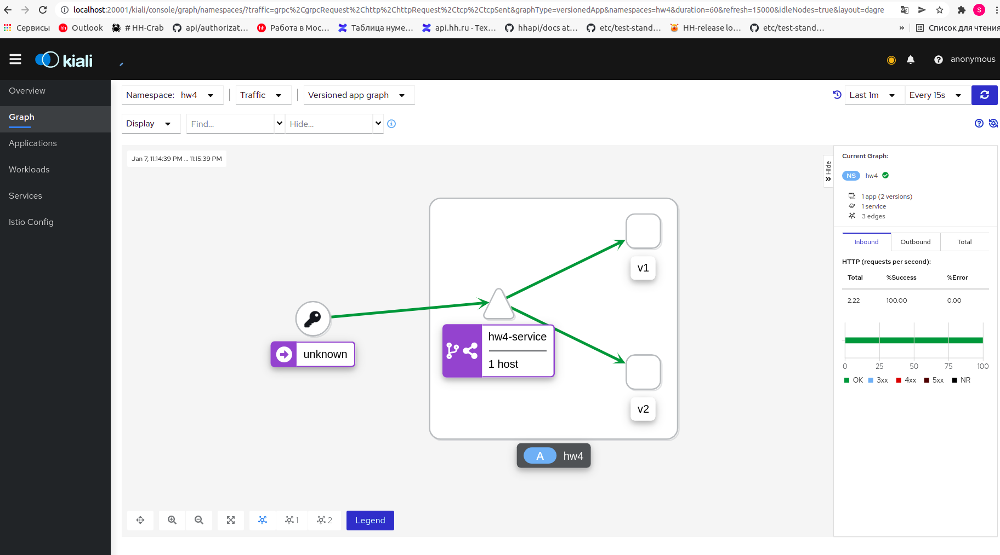

## Домашнее задание №4

### Запуск

Minikube надо запускать с Virtualbox. Замените на свою версию k8s.

`minikube start --driver virtualbox --cpus=4 --memory=8g --cni=flannel --kubernetes-version="v1.22.3"`


Установить Istio из папки со скачанной программой:

`istioctl install --set profile=demo -y`

Из папки `hw4` применить команду:

```
kubectl apply -f . &&
kubectl apply -f https://raw.githubusercontent.com/istio/istio/release-1.12/samples/addons/prometheus.yaml &&
kubectl apply -f https://raw.githubusercontent.com/istio/istio/release-1.12/samples/addons/kiali.yaml &&
kubectl label namespace hw4 istio-injection=enabled &&
kubectl apply -f ./entities -n hw4 &&
kubectl apply -f ./istio-rules -n hw4
```

Для проверки выполнить команду:

```
for i in `seq 1 100`; do curl http://$(minikube ip):31317/health; done
```

Посмотреть график в kiali из папки с Istio:

`istioctl dashboard kiali`

Изображение:


### Задание 
Развернуть Minikube
Развернуть Istio c Ingress gateway
Развернуть две версии приложения с использованием Istio
Настроить балансировку трафика между версиями приложения на уровне Gateway 50% на 50%
Сделать снимок экрана с картой сервисов в Kiali с примеров вызова двух версии сервиса

### Неисправности
Если не устанавливается Istio, из папки со скачанной программ выполнить.

`export PATH=$PWD/bin:$PATH` 

Инструкция https://istio.io/latest/docs/setup/getting-started/#download


Проверить что в minikube есть ingress:
`minikube addons enable ingress`

Minikube надо запускать с Virtualbox

`minikube start --driver virtualbox --cpus=4 --memory=8g --cni=flannel --kubernetes-version="v1.22.3"`

### Ссылки
Докер образ сделан по гайду https://nodejs.org/en/docs/guides/nodejs-docker-webapp/

Ingress istio guide https://istio.io/latest/docs/tasks/traffic-management/ingress/ingress-control/
